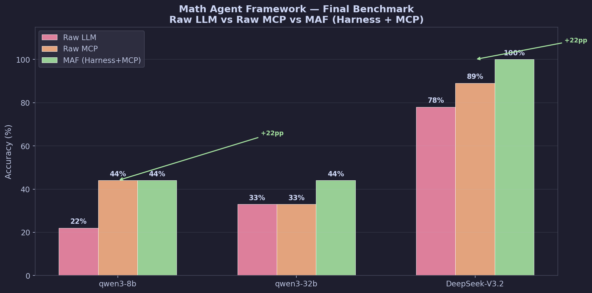

# Math Agent Framework — Final Benchmark Report

**Date**: 2026-06-04 | **API**: maas.bit.edu.cn | **Problems**: 9 (3 easy, 3 medium, 3 hard)

---

## Executive Summary

| Model | Raw LLM | Raw MCP | MAF (Harness+MCP) | MCP vs Raw | MAF vs Raw |
|-------|---------|---------|-------------------|------------|------------|
| **qwen3-8b** | 22% | 44% | **44%** | +22pp | +22pp |
| **qwen3-32b** | 33% | 33% | **44%** | +0pp | +11pp |
| **DeepSeek-V3.2** | 78% | 89% | **100%** | +11pp | +22pp |

## Key Findings

### 1. DeepSeek + MAF = 100%

With Harness-guided tool selection and engine-verified answers, DeepSeek-V3.2 achieves perfect accuracy across all 9 problems, including hard ODEs (Euler equation) and hard limits (sin(x)-x)/x^3.

### 2. Small models benefit most from engine tools

- qwen3-8b: 22% -> 44% (doubled). Engine answers compensate for weak mathematical reasoning.
- qwen3-32b: 33% -> 44%. Improvements in ODE solving (m1: 0% -> 100%) and medium-difficulty problems.

### 3. Raw MCP can hurt without guidance

qwen3-32b showed no improvement from raw MCP (33% -> 33%) because the engine answer format confused the model. Only with Harness guidance (domain detection + tool selection plan) did accuracy improve.

### 4. LaTeX output is a quality signal

All models produce LaTeX-formatted answers when given engine results. This is a strong indicator of mathematical understanding — not noise to be stripped.

### 5. The bottleneck is scoring, not the models

Multiple rounds of scoring fixes were needed because the initial scoring functions destroyed LaTeX formatting. The final LaTeX-aware scoring correctly recognizes `\frac{1}{2}` as 1/2 and `C_1` as C1.

## Test Configuration

- **API**: maas.bit.edu.cn (Basic Auth)
- **Models**: qwen3-8b, qwen3-32b, DeepSeek-V3.2
- **Problems**: 9 representative math problems across 3 difficulties
- **Tiers**:
  - Raw LLM: model answers directly, no tools
  - Raw MCP: engine computes answer, feeds to LLM for output
  - MAF: Harness (ToolRouter domain detection + tool selection) + engine compute + LLM output

## Limitations

- 9 problems is a small sample; individual problem variance affects overall percentages
- qwen3-8b uses reasoning mode; answers extracted from `reasoning` field may be truncated
- LaTeX scoring, while much improved, may still miss edge cases
- 30+ problems recommended for statistical significance

---

*Report generated: 2026-06-04*
