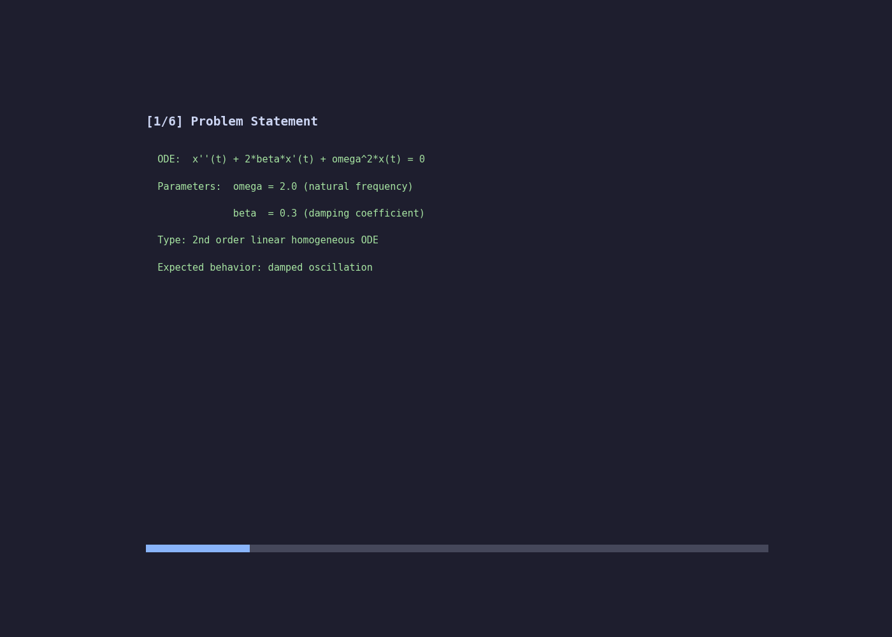

# Demo: Damped Harmonic Oscillator



> 80-frame mathematical visualization — 3 damping regimes + phase portrait.

## What This Shows

The damped harmonic oscillator solved and visualized:

- **Left**: x(t) displacement curves — underdamped (blue), critically damped (green), overdamped (red)
- **Right**: Phase portrait — velocity vs position for all three regimes
- **Bottom**: Progress bar showing derivation -> numerical solution -> verification

## Social Media Formats

All formats ready for direct upload:

| File | Format | Use For |
|------|--------|---------|
| `demo.gif` | GIF (710 KB) | GitHub README, tweets, Reddit |
| `demo.mp4` | MP4 H.264 (59 KB) | Twitter/X, LinkedIn, WeChat |
| `demo_instagram.mp4` | 1080x1080 MP4 (84 KB) | Instagram post |
| `demo_tiktok.mp4` | 1080x1920 MP4 (118 KB) | TikTok, Stories, Shorts, Reels |
| `demo_preview.png` | PNG 1200x550 (98 KB) | Static preview, thumbnail |
| `demo_livephoto.mov` | MOV (59 KB) | Apple Live Photo (video part) |
| `demo_still.jpg` | JPEG (63 KB) | Apple Live Photo (still part) |

### Live Photo Setup (Apple)

For iOS/macOS, combine `demo_livephoto.mov` + `demo_still.jpg`:

- **iPhone**: AirDrop both files to Photos app, or use apps like "Live Maker" or "intoLive"
- **macOS**: Open both in Photos, select both, right-click -> "Create Live Photo"
- **iMessage**: Drag `demo_livephoto.mov` directly — recipients on iOS 17+ see it as animated

### Direct URLs (for embedding)

```
GIF:  https://raw.githubusercontent.com/symmetryseeker/math-agent-framework/main/demo/demo.gif
MP4:  https://raw.githubusercontent.com/symmetryseeker/math-agent-framework/main/demo/demo.mp4
PNG:  https://raw.githubusercontent.com/symmetryseeker/math-agent-framework/main/demo/demo_preview.png
```

## Run It Yourself

```bash
pip install math-agent-framework
math-agent derive harmonic_oscillator
```
